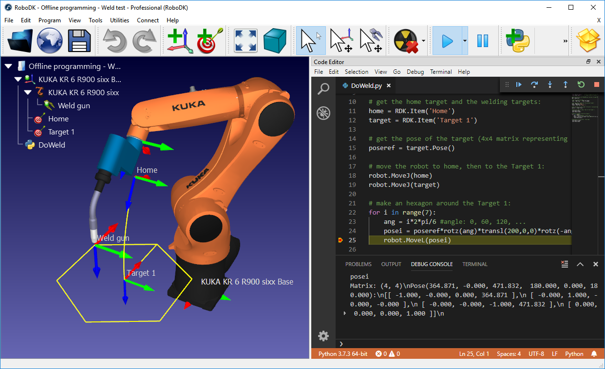

RoboDK API for Python
======================

This package allows you to interact with RoboDK software for simulation and programming industrial robots. With the RoboDK API for Python it is possible to simulate and program any industrial robot using Python programming language. The RoboDK API provides an alternative to using vendor-specific programming languages. 



Full package description on [Python PyPi](https://pypi.python.org/pypi/robodk/)

Read the [RoboDK API description](../README.md) for more information.


Requirements
------------
- [Python](https://www.python.org/downloads/) (Python 2 and Python 3 supported)
- [RoboDK](https://robodk.com/download)

Mac and Linux usually have Python 2 installed by default.

How to install
------------
RoboDK automatically uses the PYTHONPATH environment variable pointing to the /RoboDK/Python/ folder to use the robodk.py and robolink.py modules.

Alternatively, you can also install the RoboDK package for Python:
```
# cd path-to-python/Scripts
pip install robodk
```

The Python interpreter and editor used by RoboDK can be set in:
 - Tools-Options-Other

Note: although it is not required, on Linux, Python 3 can be installed by typing:
```
sudo apt-get install pip3
sudo apt-get install idle3
```

Python Example
------------
```python
from robolink import *    # RoboDK's API
from robodk import *      # Math toolbox for robots

# Start the RoboDK API:
RDK = Robolink()

# Get the robot item by name:
robot = RDK.Item('Fanuc LR Mate 200iD', ITEM_TYPE_ROBOT)

# Get the reference target by name:
target = RDK.Item('Target 1')
target_pose = target.Pose()
xyz_ref = target_pose.Pos()

# Move the robot to the reference point:
robot.MoveJ(target)

# Draw a hexagon around the reference target:
for i in range(7):
    ang = i*2*pi/6 #ang = 0, 60, 120, ..., 360

    # Calculate the new position around the reference:
    x = xyz_ref[0] + R*cos(ang) # new X coordinate
    y = xyz_ref[1] + R*sin(ang) # new Y coordinate
    z = xyz_ref[2]              # new Z coordinate
    target_pos.setPos([x,y,z])

    # Move to the new target:
    robot.MoveL(target_pos)

# Trigger a program call at the end of the movement
robot.RunCode('Program_Done')

# Move back to the reference target:
robot.MoveL(target)
```

App loader Plug-In
-----------------
Once you have a script working in Python you can easily set it up as an App using the App loader plugin. RoboDK Apps allow you to customize the RoboDK environment for simulation and offline programming. 
RoboDK Apps can be easily distributed for production. More information here:
* https://github.com/RoboDK/Plug-In-Interface/tree/master/PluginAppLoader


Linting (source-code checker)
-----------------------------
Pylint is a source-code, bug and quality checker for Python programming. Pylint is integrated by default when using RoboDK's default settings (VScode/VScodium text editor). 

If you prefer using other text editors you can use the pylint_robodk module with Pylint for linting. The following argument must be passed to pylint to activate this feature:
* --load-plugins=pylint_robodk
